# AquaNexus

**A river habitat model, and a measurement of how far it can be trusted.**

Bathymetric point clouds → HEC-RAS hydraulics → two trained models → an explainable
API and a dashboard, built end to end on the **Ayase River (綾瀬川)** in Saitama.

Then the part that is harder to find in a portfolio project: the finished model was
applied, unchanged, to a river it had never seen — the **Naka (中川)**, held out from
the first day and untouched until the rest was done. It transfers where it has
evidence (R² **+0.336**, against +0.394 at home) and collapses where it does not
(**−0.903**). That is a measured boundary on every other number here.

<p align="left">
  
  
  
  
  
  
  
</p>

---

## What it demonstrates

**A model with a measured domain.** Predicting dissolved oxygen from physics and
season scores R² 0.394 on the Ayase under cross-validation with whole stations held
out — a modest result, and 0.009 R² better than assuming no change since the last
sample. On the held-out Naka it works inside its training ranges and fails outside
them, which is a sharper statement of scope than any single score.

**Numbers that survive their own audit.** Three published results got *worse* when
defects were found, and the corrections are in the repository rather than the
history:

| Published | Corrected | Why |
|---|---|---|
| R² 0.442, RMSE 1.713 | **R² 0.394, RMSE 1.785** | Four cross-sections were cut through bank, not channel. Removing them cost 0.05 R² and a third of the hydraulic pipeline's apparent value. |
| Temp × discharge synergy −1.02 mg/L | **retracted** | Computed on one station's 48 rows. Pooled over 138 the sign reverses. |
| SHAP explanations, well-formed | **were all zeros** | The explainer's background was the request itself, so every contribution was exactly 0.0 — and the test asserting they summed correctly passed on 0 = 0. |

**Provenance that cannot be separated from the number.** Two models ship: one on
real measurements, one on labels this project generated. The synthetic one is
marked `SYNTHETIC` in every response, and the dashboard renders each prediction's
caveats in the same card as the value.

## What it is built from

Japan publishes an exceptionally rich set of open environmental records, and much
of this project is an exercise in finding and stitching them together:

| Layer | Source | Why it matters |
|---|---|---|
| **Channel bathymetry** | 埼玉県 河川点群データ (CC BY 4.0) | UAV drone **plus narrow multibeam echosounder** — includes the *submerged* bed, which topographic LiDAR cannot see |
| **Water quality** | 環境省 水環境総合情報サイト / 埼玉県 公共用水域水質測定 | Monthly grab samples with co-measured discharge and temperature |
| **Meteorology** | 気象庁 過去の気象データ | Air temperature, solar radiation (公共データ利用規約) |
| **Biology** | 河川水辺の国勢調査 (東京都建設局) | Fish & benthic surveys, 1995–2024, for independent validation |
| **Hydrology** | 国土交通省 水文水質データベース | Discharge & stage — **manual download only** (see note) |

> **On `river.go.jp`:** the national hydrology database explicitly prohibits automated
> acquisition. This project does not scrape it. Discharge for boundary conditions is
> pulled by hand, and `scripts/download_data.py` documents why no fetcher exists.

---

## Pipeline

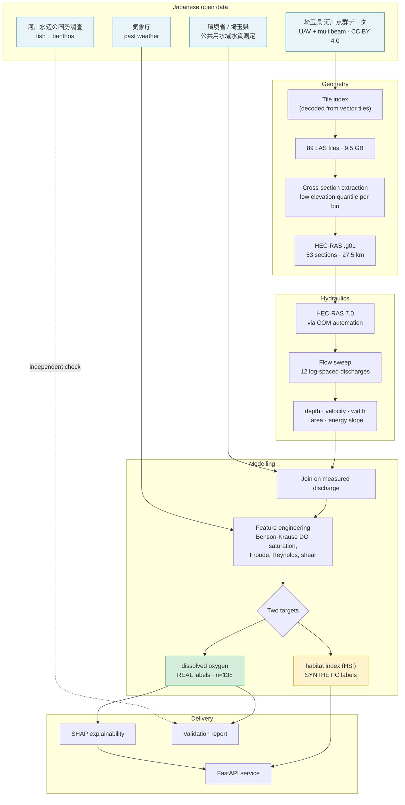

---

## The river

The Ayase spent years ranked as **Japan's most polluted river**, then recovered
measurably under the 清流ルネッサンス programme. That documented water-quality
gradient is what makes it worth modelling — there is a real signal to find.

### Channel geometry, built from open bathymetry

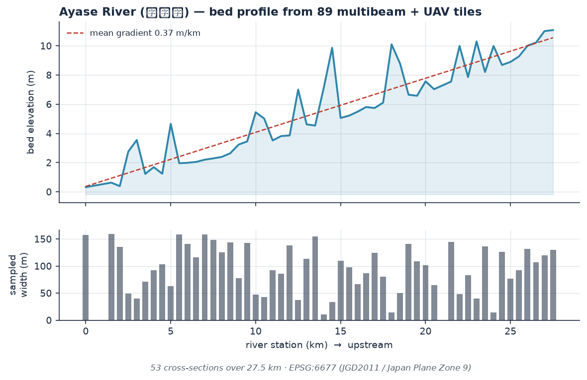

**27.5 km, 49 cross-sections** (of 53 extracted; four were cut through bank where
the centreline wandered and are excluded — see
[`docs/CONSTRICTION_IMPACT.md`](docs/CONSTRICTION_IMPACT.md)), from 89 point-cloud
tiles. The bed falls
**10.8 m — a gradient of 0.39 m/km**, which is the sanity check that the reach hangs
together rather than being 53 unrelated sections.

The tiles carry **no ground classification** — every point is class 1 — so bare earth
cannot be selected by filtering. Instead points are binned across each section and a
low elevation quantile taken per bin, which keeps the bed while rejecting vegetation
above and multibeam outliers below.

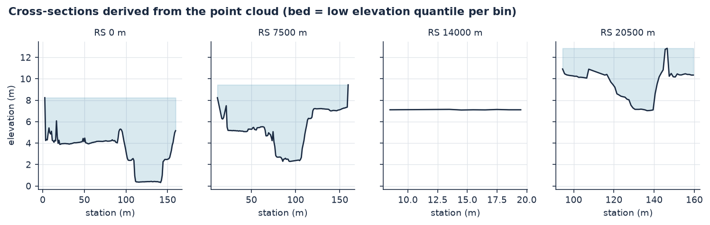

### Hydraulic response

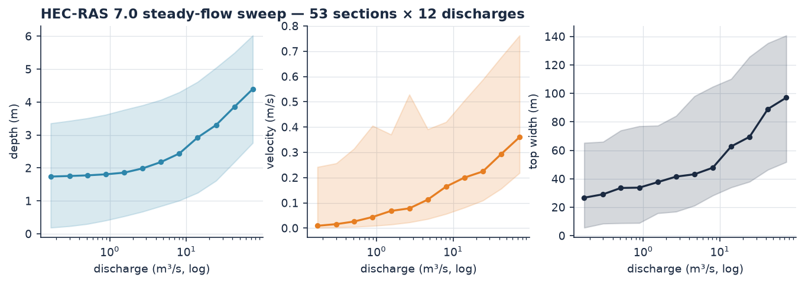

HEC-RAS 7.0 driven through its COM automation server across **12 log-spaced
discharges** spanning the full observed range (0.17 – 73.7 m³/s). Log spacing matters:
discharge covers two and a half orders of magnitude, so linear spacing would put
almost every profile at the high end and misrepresent low flows — which is where
habitat stress actually bites.

At high flow the top width jumps sharply as water spreads onto the flood terrace
(高水敷) beside the channel.

---

## The observed record

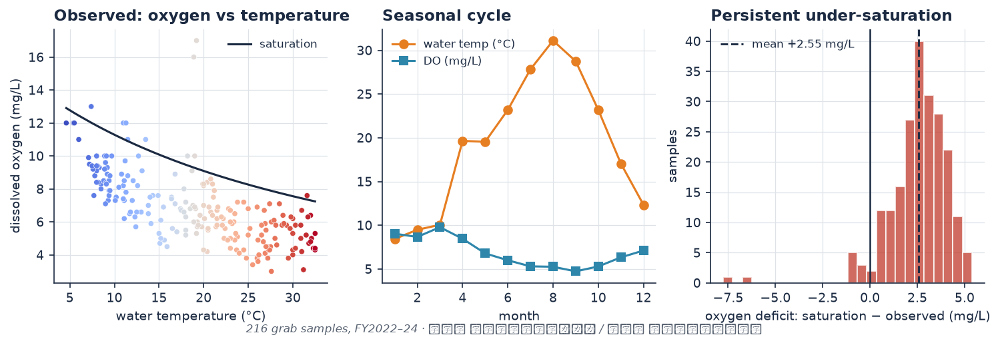

**216 grab samples across FY2022–24.** Three things visible here:

1. **Oxygen tracks temperature**, as physics requires — but sits consistently *below*
   the saturation curve.
2. **A clear seasonal cycle**, with summer oxygen minima.
3. **A persistent deficit of ≈2.4 mg/L below saturation.** That is a real, measured
   property of this river and exactly what a habitat model should care about.

Points *above* the saturation line are genuine supersaturation from spring algal
photosynthesis, reaching 17 mg/L. The pipeline deliberately allows the deficit to go
negative rather than clipping it — supersaturation is itself a eutrophication signal.

---

## Results

### Two models, different provenance

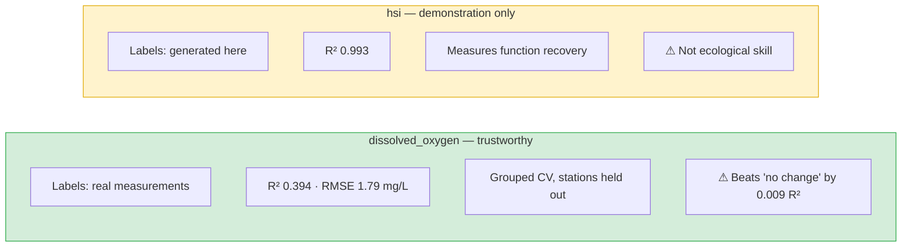

The habitat index scores R² 0.99 — and that number means very little, because the
labels are generated by this repository from ecological response curves. The model is
recovering a function it was given. **It is served, and labelled `SYNTHETIC`
everywhere it appears**, because scenario analysis needs a bounded habitat score; it
is not presented as a result.

The dissolved-oxygen model is the honest one.

### Model comparison on real labels

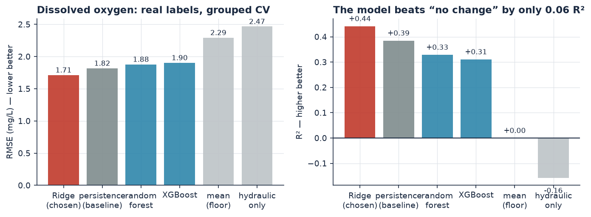

**Ridge beats both tree models.** At 138 rows and 10 features, gradient boosting
overfits. The project specification assumed XGBoost would win; on this dataset it
does not, and that is reported as found.

**The persistence baseline is the finding.** "Same oxygen as last month at this
station" scores R² 0.385 against the model's 0.394 — and *beats it on MAE*. The model
earns its place by working where no previous sample exists and generalising to unseen
stations, neither of which persistence can do. But the honest headline is
*"barely better than assuming no change"*, not *"R² 0.39"*.

### Does the hydraulic model earn its place?

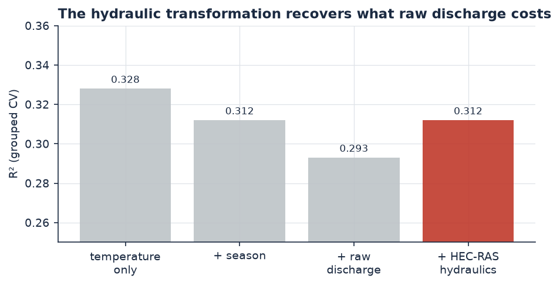

This is the project's central claim, tested directly:

- Adding **raw discharge** to temperature *hurts* (−0.019 R²)
- Adding **the hydraulic model's transformation** of that same discharge — depth,
  velocity, width, Froude — recovers most of it (+0.019)

So the physics-informed step carries information the raw driver does not, and that is
the whole of the claim. It does not beat temperature on its own (0.312 against 0.328),
hydraulics alone predict nothing (R² −0.31), and simply adding air temperature — free,
no hydraulic model — is worth more (+0.073). **The effect is real and small, and the
first version of this figure overstated it**: on the geometry that included four bad
cross-sections it read +0.062, three times what the corrected geometry supports.

### Where it fails

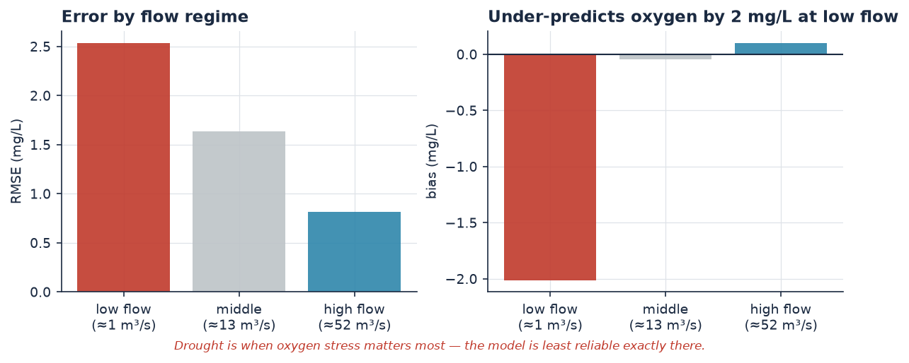

**At low flow the model under-predicts oxygen by 2.3 mg/L**, with triple the
high-flow error. That is the worst possible place for this weakness: drought is when oxygen
stress threatens habitat, so the model is least reliable exactly where it would be
consulted.

This is surfaced in the API response, not left in a table.

### Does it work on a river it has never seen?

The Naka (中川) was reserved as a held-out reach during the data audit and left
untouched until the rest of the project was finished. 53 tiles, 39 cross-sections,
192 observations across 5 stations — a different river in the same prefecture, run
through an identical pipeline, then handed to the **unchanged** Ayase model.

| | n | RMSE | R² | bias |
|---|---|---|---|---|
| Ayase model, unchanged | 192 | 2.161 | **−0.081** | −1.29 |
| — where the model has evidence | 129 | 1.672 | **+0.336** | −0.77 |
| — extrapolating | 63 | 2.917 | **−0.903** | −2.34 |
| mean of the Naka (floor) | 192 | 2.079 | 0.000 | — |
| trained on the Naka (ceiling) | 192 | 1.495 | +0.483 | −0.11 |

**Pooled, it fails: −0.081 R², worse than predicting the Naka's own mean.** Split,
it says something more useful. Where the observation lies inside the ranges the
model was fitted on it scores **+0.336 against +0.394 at home** — it transfers to a
different catchment nearly intact. Where it does not, it collapses to −0.903. A
third of this river is outside what the Ayase ever showed it, and the pooled number
is the average of those two régimes.

That is precisely what `out_of_range` marks on every prediction the API returns.
This is what that flag is worth.

The transfer is biased −1.29 mg/L, and **the direction was written down before the
run**: the Naka carries 8.0–8.8 mg/L against the Ayase's 6.9, so a model fitted to
the more polluted river reads the cleaner one as worse than it is.

Full protocol and per-station results: [`docs/HOLDOUT_RIVER.md`](docs/HOLDOUT_RIVER.md).

---

## Explainability

SHAP with model-type dispatch — `TreeExplainer` for ensembles, `KernelExplainer` for
the Ridge pipeline.

**Retracted finding:** an earlier run reported water temperature × discharge as
interacting **synergistically at −1.02 mg/L**. That was computed on one station's 48
observations. Pooled over all 138 the interaction is **+0.23 mg/L**, and the sign
flips between stations (−0.93 to +1.72). The effect is not established at this sample
size, and the retraction is worked through in
[`notebooks/04_explainability.ipynb`](notebooks/04_explainability.ipynb).

**Limitation, reported rather than hidden:** ten feature pairs correlate at
|r| ≥ 0.9, because the hydraulic features are all derived from discharge through the
same model. SHAP sums correctly per prediction but divides credit between such
features arbitrarily. Two of four interaction pairs tested are outright
**unidentifiable** — one corner of the 2×2 design is empty, since "high discharge, low
velocity" never occurs. The analysis returns `identifiable: False` with a reason
rather than a bare `NaN`, which would read as "no interaction".

---

## API

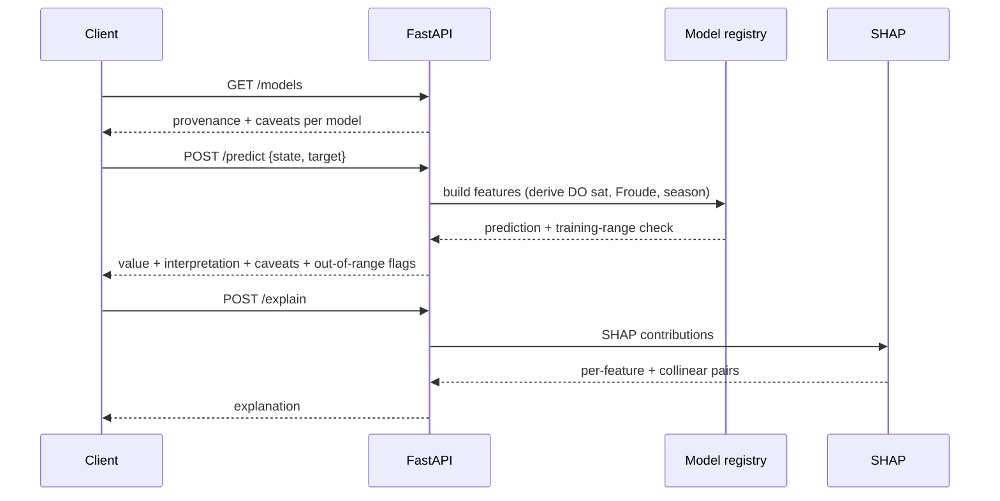

| Endpoint | Purpose |
|---|---|
| `GET /health` | Liveness; reports `degraded` with a reason rather than dying |
| `GET /models` | **Read first** — declares which model uses synthetic labels |
| `POST /predict` | Single state, with caveats and out-of-range flags |
| `POST /batch_predict` | Up to 1,000 states |
| `POST /scenario_run` | What-if against a baseline |
| `POST /explain` | SHAP contributions + collinear-pair warnings |

```bash
uvicorn aquanexus.api.app:app --reload   # docs at localhost:8000/docs
docker compose up                        # same thing in a container
python scripts/verify_deployment.py      # 14 smoke checks against a running API
```

Design decisions worth noting:

- **Out-of-range inputs are answered and flagged, not refused.** Refusing is unhelpful;
  answering silently would imply confidence the model has not earned.
- **Partial states predict.** A grab sample is partial by nature.
- **`/scenario_run` carries the hydraulics with the discharge**, re-interpolating
  depth, velocity and width from the HEC-RAS sweep so a drought is not evaluated at
  the flood's depth — while saying plainly that the sweep is precomputed and this
  is a sensitivity, not a forecast.
- **Models are not baked into the image.** They are build outputs, so the container
  reads them from the mounted `./data`. Without that mount it starts *degraded* and
  `/health` says why, rather than serving predictions from nothing.

Full reference: [`docs/API_REFERENCE.md`](docs/API_REFERENCE.md).

---

## Dashboard

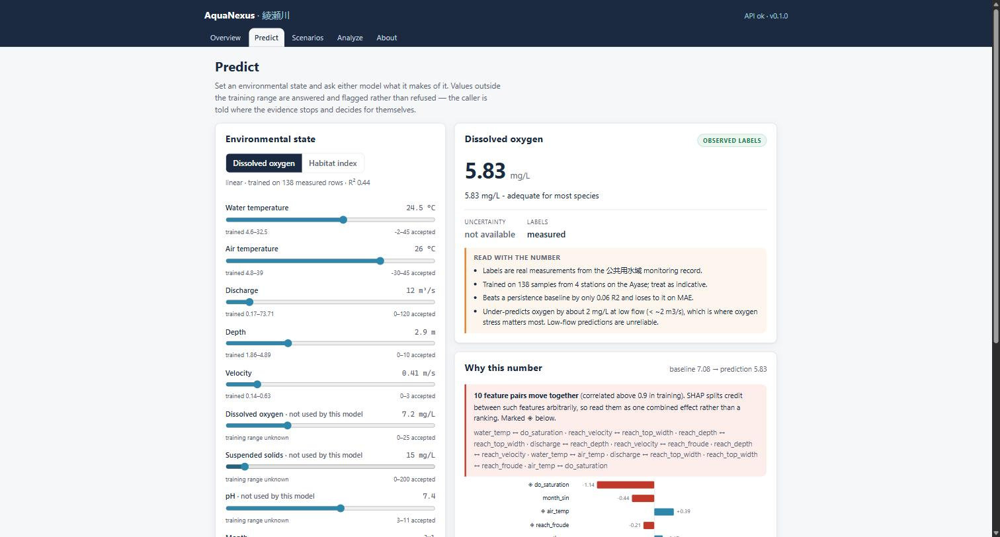

React + TypeScript, talking to the API above. The interesting constraint is that
one of the two served models is trained on generated labels — so the interface is
built around making that inseparable from the number:

- **every reading is drawn on a gauge staff**, against the range actually measured
  on this river. A value near the edge of the evidence looks near the edge, and one
  outside it is drawn outside the band rather than described as outside in a
  sentence somebody may not read;
- **caveats hang in the margin beside the reading**, on the rule that joins them to
  it — annotations on a survey drawing, not a tinted box underneath;
- the **collinearity warning sits above the SHAP chart**, because the bar order is
  not a ranking and a reader who sees the chart first has already concluded it is;
- the two models are not drawn as peers: the measured one is the sheet, the
  generated one is set back;
- ranges come from `/models`, never copied into the frontend, so they cannot drift
  from the model. Input outside them is flagged, not blocked — matching the API.

Monospace means "this is a measured quantity" and is never used for labels; the
palette is the one `scripts/make_figures.py` draws the figures above with.

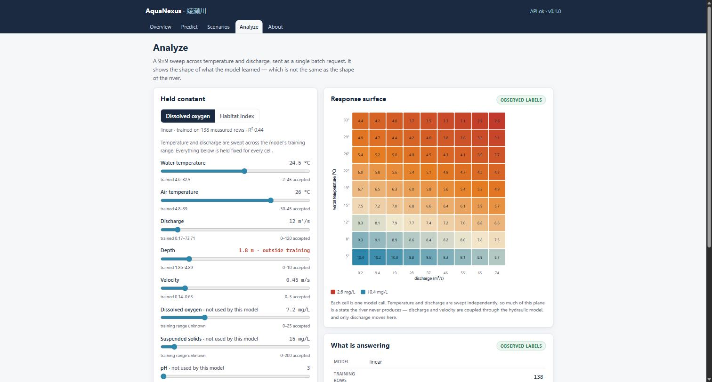

The response surface is 81 real model calls in one `/batch_predict`, swept across the
training range. It shows oxygen falling with both temperature and discharge — and says
plainly that most of that plane is a state the river never produces, since discharge
and velocity are coupled through the hydraulic model and only one of them moves here.

```bash
cd frontend && npm install && npm run dev   # http://localhost:3000
```

`src/test/provenance.test.tsx` exists to stop a refactor quietly dropping any of
those properties. See [`frontend/README.md`](frontend/README.md).

> **Container status:** both images build in CI on every push, and the API container
> starts there and answers `/health` correctly in its degraded state (CI has no
> trained artefacts). Nothing is built on the development machine, which has no
> Docker. What remains unverified — the frontend container running, nginx's own
> handling of the SPA fallback, the healthcheck loops — is listed in
> [`docs/DEPLOYMENT.md`](docs/DEPLOYMENT.md).

---

## Quickstart

```bash
git clone https://github.com/kiruthick01/AquaNexus.git
cd AquaNexus

python -m venv .venv && source .venv/bin/activate   # Windows: .venv\Scripts\activate
pip install -e ".[ml,api,dev]"                      # add ",geo" for point clouds
cp .env.example .env

pytest                                              # 378 tests
```

Rebuild the whole thing:

```bash
python scripts/download_data.py                     # water quality
python scripts/build_geometry.py --river ayasegawa  # tiles → HEC-RAS → run
python scripts/train_models.py                      # both models + manifest
python scripts/make_figures.py                      # the figures above
uvicorn aquanexus.api.app:app --reload

cd frontend && npm install && npm run dev           # dashboard on :3000
```

> HEC-RAS 7.x on Windows is required to *generate* hydraulics, not to run the API.
> See [`docs/HECRAS_GUIDE.md`](docs/HECRAS_GUIDE.md) for the file-format traps —
> several produce silent failures rather than errors.

---

## Layout

```
src/aquanexus/
├── config.py          settings singleton (pydantic-settings)
├── data/
│   ├── pointcloud.py  tile index recovery, download, LAS loading
│   ├── loader.py      公共用水域 検体値 monitoring records
│   ├── biology.py     河川水辺の国勢調査 fish & benthic surveys
│   ├── preprocessor.py Benson-Krause DO saturation, Froude, Reynolds, shear
│   ├── synthetic.py   habitat index + falsification harness
│   ├── dataset.py     state vectors; the hydraulics↔chemistry join
│   └── validator.py   quality checks on sections, observations, datasets
├── hecras/
│   ├── geometry.py    cross-section extraction, .g01 export
│   ├── reader.py      .prj / .g01 parsing
│   ├── project.py     writes runnable projects from templates
│   └── runner.py      COM automation
├── ml/
│   ├── models.py      XGBoost / Random Forest / Ridge / mean floor
│   ├── splits.py      grouped, spatial, flow, temporal (+ leaky, for contrast)
│   ├── trainer.py     benchmarking
│   ├── evaluator.py   metrics incl. skill against an explicit floor
│   ├── explainer.py   SHAP, interactions, thresholds, collinearity
│   └── validator.py   baselines: hydraulic-only, linear, persistence
└── api/               FastAPI service
```

---

## Honest limitations

Stated here rather than discovered later:

| Limitation | Detail |
|---|---|
| **Small sample** | The real target has **n = 138** across 4 stations. Everything should be read with that attached. |
| **Not deployed** | No authentication, no TLS, no shared rate limit. `docs/DEPLOYMENT.md` lists what would have to change first. |
| **Barely beats persistence** | +0.009 R², and loses on MAE. |
| **Transfers only inside its evidence** | On a held-out river it scores +0.336 where inputs are in range and −0.903 outside it, pooling to −0.081 — worse than that river's mean. The domain is the training range, not "rivers". |
| **Unreliable at low flow** | Under-predicts oxygen by ~2 mg/L below ≈2 m³/s. |
| **Manning's *n* is assumed** | 0.035 channel / 0.06 overbank, not calibrated — no gauged rating curve exists for this reach. **Measured, not hand-waved:** across the plausible range 0.025–0.050 the predictions move up to 0.26 mg/L, 15% of the model's RMSE. See [`docs/MANNING_SENSITIVITY.md`](docs/MANNING_SENSITIVITY.md). |
| **HSI labels are synthetic** | Generated here from response curves. High accuracy = function recovery. |
| **Biology is validation only** | n = 6 for the Ayase. Too small to train on; used as an independent check. |
| **4 sections were excluded** | Cut through bank where the centreline wandered. Measured at 64% of the model's error, then removed and everything retrained — see [`docs/CONSTRICTION_IMPACT.md`](docs/CONSTRICTION_IMPACT.md). |
| **Chemistry treated as reach-uniform** | 5 stations over 27 km sampled monthly cannot support a per-section field. |

---

## Documentation

| Document | Contents |
|---|---|
| [`docs/DATA_SOURCES.md`](docs/DATA_SOURCES.md) | Availability audit — what exists, what doesn't, what's licensed how |
| [`docs/ML_METHODOLOGY.md`](docs/ML_METHODOLOGY.md) | Every result, every deviation from spec, with reasons |
| [`docs/HECRAS_GUIDE.md`](docs/HECRAS_GUIDE.md) | File-format rules that fail silently |
| [`docs/ARCHITECTURE.md`](docs/ARCHITECTURE.md) | Module boundaries and design decisions |
| [`DEVLOG.md`](DEVLOG.md) | Short daily progress notes |
| [`docs/MANNING_SENSITIVITY.md`](docs/MANNING_SENSITIVITY.md) | What the uncalibrated roughness is worth |
| [`docs/CONSTRICTION_IMPACT.md`](docs/CONSTRICTION_IMPACT.md) | Why four cross-sections were removed |
| [`docs/HOLDOUT_RIVER.md`](docs/HOLDOUT_RIVER.md) | The Naka: what happens on a river the model has never seen |
| [`CONTRIBUTING.md`](CONTRIBUTING.md) | Running it, and the conventions a change follows |
| [`docs/DEPLOYMENT.md`](docs/DEPLOYMENT.md) | Running it, container notes, and what is still unverified |
| [`notebooks/`](notebooks/) | Point-cloud→hydraulics walkthrough, data exploration, training, SHAP, validation |
| [`frontend/README.md`](frontend/README.md) | Dashboard structure and the constraints it has to honour |

---

## Attribution

This project is built on Japanese public data and would not be possible without it:

- **埼玉県 河川点群データ** — Saitama Prefecture river point cloud (CC BY 4.0)
- **環境省 水環境総合情報サイト** — Ministry of the Environment, public waters
- **埼玉県 公共用水域水質測定** — Saitama Prefecture water quality monitoring
- **気象庁** — Japan Meteorological Agency (公共データ利用規約 第1.0版)
- **東京都建設局 河川水辺の国勢調査** — Tokyo Metropolitan Government river census
- **国土交通省 水文水質データベース** — MLIT hydrology (manual access only)
- **HEC-RAS** — US Army Corps of Engineers, Hydrologic Engineering Center

Code is MIT. Data retains its original licensing — attribute the sources above.
